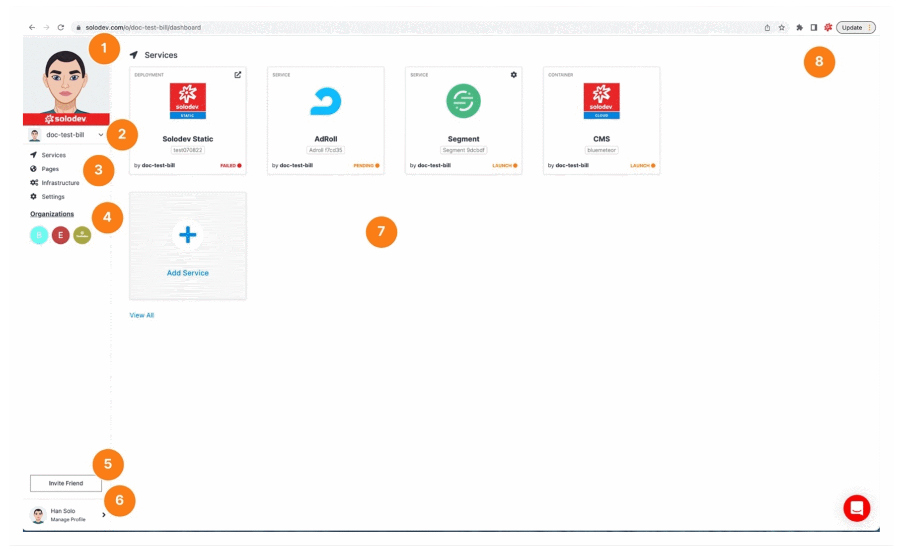

When logging in to your account (or creating a new account), you will land in your default personal developer dashboard. Your user is essentially your own organization and the admin of all things Solodev Cloud. Your personal developer space has the functionality to create, test and launch your individual projects. You will also be able to add organizations, users, groups and permissions to create collaborative efforts.

---
## Developer Workspace

Below is a general overview of the developer workspace. In general, the workspace will remain in a format similar to the above with slight variances depending on which part you are in.

1. Your custom image/avatar/logo which can be created and edited in the profile section
2. Toggle between your developer account and your organization(s)
3. The main left nav. Nav options will change depending upon your location, but there will always be left nav options and a back/return option
4. Click on the link to go to your organizations dashboard or click on one of the organization icons to go directly to that account
5. Refer a friend to sign up for Solodev and earn referral perks
6. Here you can log out of your account and manage your user profile by editing your image, your username, your email, password, etc.
7. This is your general workspace and most of your work will take place in this portion of the screen
8. On many screens there will be options for you in the top right corner of your workspace, including drop downs, filters and modal calls

----

---

## Developer Profile

Set up your developer profile to establish your custom user image/avatar, name, phone number, time zone and title. [Check how to do it](DeveloperProfile/index.md)

---

## Developer Account

Set up your developer account to establish basics like your custom user image/avatar, email, username and password. Your account settings can be found in the left nav under your profile. [Check how to do it](DeveloperAccount/index.md)

---

## Developer Settings

Set up your developer settings to establish basics like billing/payment details and to manage your subscriptions and purchases. [Check how to do it](DeveloperSettings/index.md)
